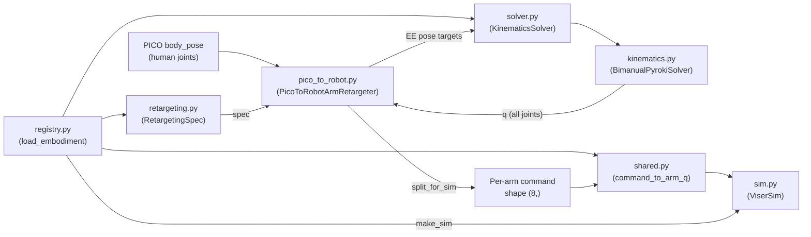

# Robot Embodiment Architecture

handumi supports multiple bimanual robot embodiments (currently **Piper** and **Axol**) through a layered design: **generic algorithms live once**, and each robot contributes **small configuration modules** that plug into those algorithms.

The entry point for applications and test scripts is the embodiment registry:

```python
from handumi.robots.registry import load_embodiment

runtime = load_embodiment("piper")
solver = runtime.solver_cls(config=runtime.config_cls())
retargeter = runtime.retargeter_cls(solver=solver, first_body_pose=..., scale=1.0, axis_map="x,z,y")
sim = runtime.make_sim()
```

---

## Design principle

| Layer | Location | Responsibility |
|-------|----------|----------------|
| **Embodiment config** | `src/handumi/robots/<name>/` | URDF naming, IK spec, retargeting spec, command layout |
| **Shared robot logic** | `src/handumi/robots/` | IK solver, Viser simulation, embodiment registry |
| **Human input logic** | `src/handumi/retargeting/` | PICO body parsing, wrist-to-EE retargeting algorithm |

A URDF file alone is **not** sufficient to drive the full stack. The URDF provides geometry and joint names, but the codebase also needs:

- semantic link labels (end-effector, shoulder, elbow),
- which joints IK solves vs. which are commanded directly (e.g. prismatic fingers),
- the project’s per-arm command vector layout,
- rest poses and workspace defaults for PICO retargeting,
- collision-pair filtering rules.

---

## Directory layout

```
src/handumi/
├── retargeting/
│   ├── pico_upper_body.py      # PICO joint indices, axis-map parsing
│   └── pico_to_robot.py        # Generic PICO → robot EE retargeting
└── robots/
    ├── kinematics.py           # Shared pyroki IK implementation
    ├── sim.py                  # Shared Viser visualization
    ├── registry.py             # load_embodiment("piper" | "axol")
    ├── piper/
    │   ├── shared.py           # URDF adapter + command_to_arm_q
    │   ├── solver.py           # PIPER_KINEMATICS_SPEC + KinematicsSolver
    │   └── retargeting.py      # PIPER_RETARGETING_SPEC + PicoToPiperArmRetargeter
    └── axol/
        ├── shared.py
        ├── solver.py
        └── retargeting.py

assets/
├── piper/piper.urdf
└── axol/urdf/axol.urdf
```

Each embodiment package has the same three files. There is **no per-robot `sim.py`**; visualization is configured through the registry.

---

## End-to-end data flow (PICO replay)



Typical frame loop (see `test/replay_pico_ik.py`):

1. `load_embodiment(name)` resolves all classes, paths, and defaults.
2. `runtime.solver_cls(config=...)` builds the IK solver from the embodiment’s `RobotKinematicsSpec`.
3. `runtime.retargeter_cls(...)` calibrates against the first PICO frame and holds a reference to the solver.
4. Each frame: `retargeter.retarget_frame(body_pose, q_current)` → full joint vector `q`.
5. `retargeter.split_for_sim(q)` → `(left_cmd, right_cmd)`, each shape `(8,)`.
6. `sim.motion_control(left=..., right=...)` maps commands to URDF joint positions and renders in Viser.

---

## Per-embodiment modules (Piper example)

### `shared.py` — URDF adapter

**Role:** Single source of truth for mapping logical joint names to strings that appear verbatim in the URDF. No other module should hard-code Piper URDF strings.

**Key contents (Piper):**

| Symbol | Purpose |
|--------|---------|
| `Joint` enum | Logical joints on one arm (`JOINT_1`…`JOINT_6`, `FINGER_1`, `FINGER_2`) |
| `ARM_JOINTS` | Revolute joints solved by IK (6 joints) |
| `FINGER_JOINTS` | Prismatic gripper joints (commanded outside IK) |
| `URDF_PATH` | Resolved path to `assets/piper/piper.urdf` |
| `COMMAND_SIZE`, `GRIPPER_INDEX` | Per-arm command vector layout |
| `urdf_joint_name()` | Logical joint → URDF joint string (`left_joint3`, etc.) |
| `urdf_body_name()` | Logical joint → URDF link string (`left_link3`, etc.) |
| `urdf_arm_joint_names()` | All 8 actuated URDF joints per arm, in Viser order |
| `urdf_revolute_joint_names()` | 6 IK joints only |
| `gripper_to_finger_positions()` | Normalized gripper `[0, 1]` → physical finger positions |
| `command_to_arm_q()` | Maps one `(8,)` command → URDF joint sub-vector for one arm |

**Axol differences:** 7 revolute arm joints; gripper is logical only (no actuated URDF joint); `command_to_arm_q` ignores index 7.

---

### `solver.py` — IK specification

**Role:** Builds the embodiment’s `RobotKinematicsSpec` and exports a ready-to-use `KinematicsSolver` class. Contains **no IK algorithm code** — only naming and collision configuration.

**Key contents (Piper):**

| Symbol | Purpose |
|--------|---------|
| `_build_robot_collision()` | Filters pyroki self-collision pairs to meaningful safety contacts (cross-arm, opposite-base-arm for Piper) |
| `PIPER_KINEMATICS_SPEC` | Links URDF names to semantic roles (EE, shoulder, elbow, joint lists) |
| `KinematicsSolver` | `make_kinematics_solver(PIPER_KINEMATICS_SPEC)` — a `BimanualPyrokiSolver` bound to Piper |

**`RobotKinematicsSpec` fields used by Piper:**

```python
PIPER_KINEMATICS_SPEC = RobotKinematicsSpec(
    name="Piper",
    urdf_path=URDF_PATH,
    left_ee_link="left_link6",           # urdf_body_name(Joint.JOINT_6, is_left=True)
    right_ee_link="right_link6",
    left_shoulder_link="left_link1",
    right_shoulder_link="right_link1",
    left_arm_joint_names=(...6 revolute...),      # joints solved by IK
    right_arm_joint_names=(...6 revolute...),
    left_control_joint_names=(...8 joints...),    # includes prismatic fingers
    right_control_joint_names=(...8 joints...),
    left_elbow_link="left_link3",
    right_elbow_link="right_link3",
    collision_builder=_build_robot_collision,
)
```

**Axol differences:** EE link is `left_gripper` / `right_gripper`; 7 IK joints; no separate control joint list; collision pairs are torso-vs-arm only.

---

### `retargeting.py` — PICO retargeting spec

**Role:** Supplies the `RetargetingSpec` and a thin subclass that binds it to the generic `PicoToRobotArmRetargeter`. Contains **no retargeting algorithm code**.

**Key contents (Piper):**

| Symbol | Purpose |
|--------|---------|
| `REST_LEFT_ARM`, `REST_RIGHT_ARM` | Posture prior when no motion is commanded (zeros = natural hanging pose) |
| `_left_front_wrist()`, `_right_front_wrist()` | Map workspace offsets to calibrated wrist positions |
| `PIPER_RETARGETING_SPEC` | Bundles rest poses, command layout, and workspace helpers |
| `PicoToPiperArmRetargeter` | Subclass that passes `PIPER_RETARGETING_SPEC` to the generic retargeter |
| Re-exports | `move_retargeter_to_front_workspace`, `settle_first_frame`, `robot_link_positions` |

**Axol differences:** 7-element rest poses with slight elbow bend; same command layout `(8,)` with gripper at index 7.

---

## Shared modules

### `kinematics.py` — IK engine

Implements `BimanualPyrokiSolver`, the single IK solve loop used by all embodiments:

- Loads URDF via pyroki/yourdfpy from `RobotKinematicsSpec.urdf_path`
- Builds collision model via optional `collision_builder`
- Resolves link indices for EE, shoulder, elbow
- Maps joint name lists to actuated joint indices
- `ik(q_current, left_pose, right_pose)` — JAX-compiled EE pose tracking with rest/posture/collision costs
- `link_pose`, `link_positions`, `fk` — forward kinematics helpers used by retargeting and diagnostics

`make_kinematics_solver(spec)` returns a subclass of `BimanualPyrokiSolver` pre-bound to that spec. Embodiment `solver.py` files call this once at import time.

`KinematicsConfig` holds shared tuning knobs (cost weights, max reach, joint delta limits) passed to every solver instance.

---

### `pico_to_robot.py` — Retargeting engine

Implements the algorithm that converts PICO upper-body poses into robot joint commands. It is **robot-agnostic** and parameterized by `RetargetingSpec`:

| Component | Purpose |
|-----------|---------|
| `RetargetingSpec` | Rest poses, command size, gripper index, front-workspace helpers |
| `calibrate_from_first_frame()` | Align human wrist-relative position with robot EE at rest |
| `PicoToRobotArmRetargeter.wrist_target()` | Apply axis map + scale to human wrist delta → robot EE position |
| `PicoToRobotArmRetargeter.target_poses()` | Build left/right EE `(position, rotation)` targets |
| `PicoToRobotArmRetargeter.retarget_frame()` | Call `solver.ik()` with EE targets |
| `PicoToRobotArmRetargeter.split_for_sim()` | Pack solver `q` into per-arm `(8,)` commands |
| `move_retargeter_to_front_workspace()` | Override calibrated wrist positions for front workspace |
| `settle_first_frame()` | Run IK iteratively on the first frame to reach a stable pose |

The retargeter keeps the **orientation fixed** to the first-frame robot EE rotation; only position tracks the human wrist.

---

### `sim.py` — Viser visualization

`ViserSim` is a concrete class (not subclassed per robot). It runs a daemon thread with a Viser web server and loads the URDF for rendering.

Constructor inputs come from the registry:

- `urdf_path`, `left_joint_names`, `right_joint_names` — from `shared.py`
- `command_size` — from `shared.py`
- `arm_q_fn` — `shared.command_to_arm_q`

**API:**

```python
await sim.enable()
await sim.motion_control(left=left_cmd, right=right_cmd)
```

Internally, `_build_q()` concatenates `arm_q_fn(left_cmd)` and `arm_q_fn(right_cmd)`, then reorders joints from solver/command order into Viser’s URDF actuated-joint order.

---

### `registry.py` — Embodiment registry

Central wiring point. `load_embodiment(name)` returns an `EmbodimentRuntime` dataclass containing:

| Field | Purpose |
|-------|---------|
| `solver_cls` | Embodiment `KinematicsSolver` |
| `retargeter_cls` | e.g. `PicoToPiperArmRetargeter` |
| `config_cls` | `KinematicsConfig` (shared) |
| `urdf_path`, `urdf_arm_joint_names` | From `shared.py` |
| `command_size`, `command_to_arm_q` | From `shared.py` |
| `move_to_front_workspace`, `settle_first_frame` | Re-exported from `pico_to_robot.py` |
| `default_port`, `default_axis_map`, `default_workspace` | Script defaults |
| `wrist_forward`, `wrist_height`, `wrist_lateral` | Front workspace offsets |
| `default_compare_axis_maps` | Axis-map candidates for `test/compare_axis.py` |

`EmbodimentRuntime.make_sim()` constructs a configured `ViserSim`.

---

## Per-arm command vector layout

Both embodiments use an `(8,)` float32 vector per arm, but semantics differ:

**Piper**

```
[ joint1, joint2, joint3, joint4, joint5, joint6, unused, gripper ]
  ←────────── 6 revolute (rad) ──────────→              ← [0, 1] → fingers
```

**Axol**

```
[ shoulder_1 … wrist_3 (7 revolute, rad), gripper ]
  ←──────────── 7 arm joints ────────────→   ← [0, 1], not rendered
```

---

## Piper vs Axol summary

| Concern | Piper | Axol |
|---------|-------|------|
| Arm DOF (IK) | 6 revolute | 7 revolute |
| Gripper in URDF | 2 prismatic fingers | Fixed link, no actuator |
| EE link | `left_link6` | `left_gripper` |
| Rest pose | All zeros | Slight elbow bend |
| Collision pairs | Cross-arm, opposite-base-arm | Torso vs arm |
| Default Viser port | 8003 | 8002 |

---

## Related docs and scripts

- [Adding a new embodiment](add-new-embodiment.md)
- `test/replay_pico_ik.py` — replay PICO dataset through IK + optional Viser
- `test/compare_axis.py` — compare axis-map candidates in a Viser grid
